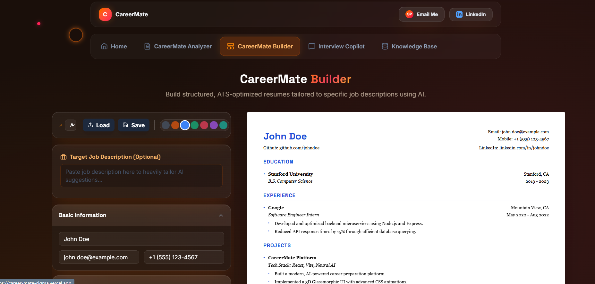
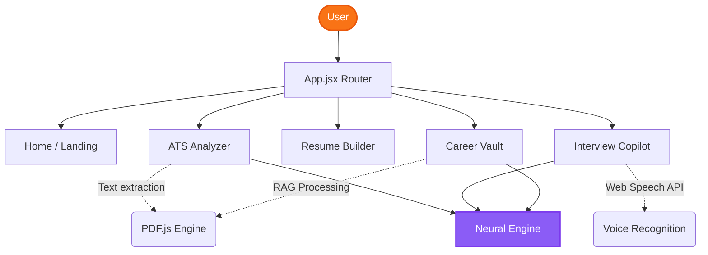

# CareerMate 🚀

<div align="center">
  <a href="https://career-mate-sigma.vercel.app/">
    
  </a>
</div>

<br />

CareerMate is a comprehensive, AI-powered career preparation platform designed to help job seekers land their dream roles. Built entirely with React and Vite, it operates natively in the browser to ensure total privacy. The platform features an intelligent ATS Resume Analyzer, a dynamic Resume Builder, and a voice-enabled Interview Copilot that simulates real-world technical interviews and provides actionable feedback.

<br />

<div align="center">
  
</div>

<br />
## ✨ Core Features

### 🛡️ Enterprise-Grade Security
Your data is yours. All AI processing and metric analysis is done locally within your browser using secure zero-retention policies. No personal resumes or documents are ever stored on external servers.

### 📄 ATS Resume Analyzer
Upload your current resume and instantly receive a deep-dive analysis on how Applicant Tracking Systems (ATS) read your profile. Get actionable, AI-driven feedback on missing keywords, formatting errors, and impact metrics.

### 🎙️ Interview Copilot
Simulate real-time, high-pressure interviews with a voice-enabled AI Copilot. Practice behavioral and technical questions specific to your target role, receiving instant, highly intelligent feedback on your answers.

### 🗄️ Career Vault (RAG AI)
Upload your past performance reviews, outdated resumes, and project documentation. Chat with your personal Vault AI to instantly retrieve forgotten metrics and past achievements while preparing for an interview or rewriting your resume. 

### 🎨 ResuMate Builder
Generate beautifully formatted, ATS-compliant resumes in seconds. Choose between Academic, Modern, Minimalist, and Creative templates designed to pass both automated parsers and human recruiters.

## 📂 Project Structure
```text
CareerMate/
├── public/                 # Static assets, 3D artwork, & generated images
├── src/
│   ├── components/         # Reusable UI (CustomCursor, ScrollReveal, Header, Footer)
│   ├── pages/
│   │   ├── Home.jsx        # Landing page with 3D wireframe & expanding cards
│   │   ├── Analyzer.jsx    # ATS scoring engine
│   │   ├── Builder.jsx     # Interactive Resume Builder
│   │   ├── InterviewCopilot.jsx # Voice-enabled AI interviewing
│   │   └── RagAssistant.jsx # Career Vault (RAG integration)
│   ├── App.jsx             # Main Router & layout configuration
│   ├── index.css           # Custom Tailwind utilities & CSS animations
│   └── main.jsx            # React root
├── .env                    # Environment variables (Neural API Key)
├── package.json            # Project dependencies
├── tailwind.config.js      # Custom theme & animation tokens
└── vite.config.js          # Vite build configuration
```

## 🏗️ Architecture Flow


## 💻 Tech Stack
- **Frontend Framework:** React.js + Vite
- **Styling:** Tailwind CSS (Custom Glassmorphism & 3D CSS Animations)
- **Icons:** Lucide React
- **PDF Processing:** PDF.js
- **AI Integration:** Neural Engine (Custom LLM Endpoint)

## 🚀 Running Locally

1. Clone the repository:
   ```bash
   git clone https://github.com/sankri15/CareerMate.git
   cd CareerMate
   ```

2. Install dependencies:
   ```bash
   npm install
   ```

3. Configure your Environment Variables:
   Create a `.env` file in the root directory and add your Neural Engine API key:
   ```env
   VITE_NEURAL_API_KEY=your_api_key_here
   ```

4. Start the development server:
   ```bash
   npm run dev
   ```

## 🎯 Design Philosophy
CareerMate was designed to break away from the traditional, boring, form-based web apps. It features dynamic scroll-reveal animations, 3D rotating CSS wireframes, custom interactive mouse cursors, and deep glassmorphism to create a premium, futuristic user experience.

---

## 👩‍💻 Author

**Sanjana Pal**
- GitHub: [@sankri15](https://github.com/sankri15)
- LinkedIn: [linkedin.com/in/sanjpal](https://www.linkedin.com/in/sanjpal)
- Email: [sanjanapal004@gmail.com](mailto:sanjanapal004@gmail.com)

